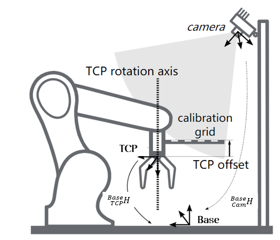
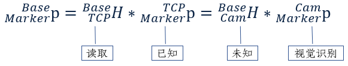
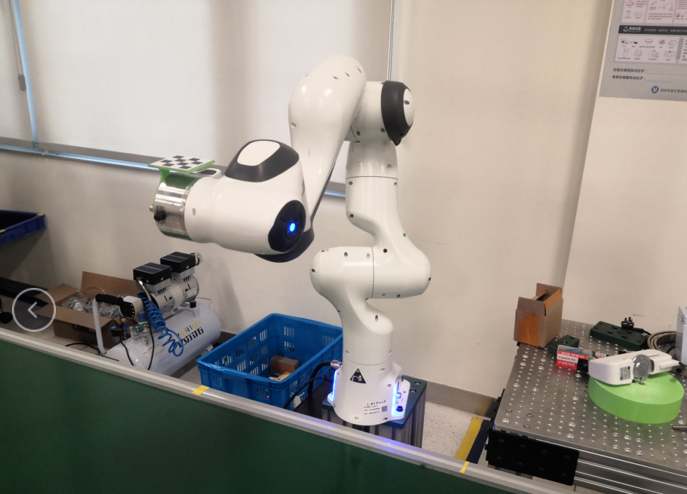
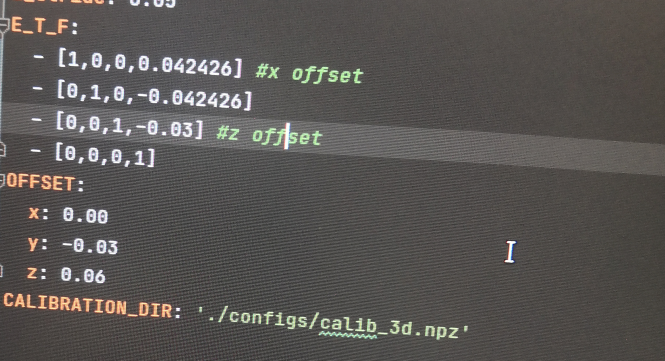
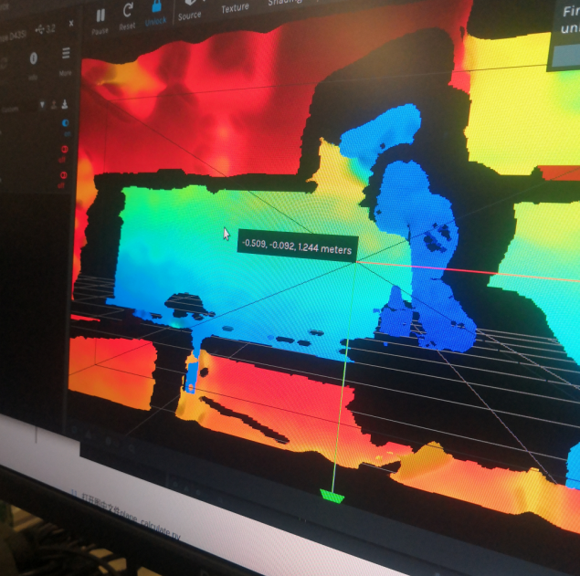

# ME336_blueTeam_pro2
## Project Goal(QIU)
The project goal is to realize 6D grasping with manipulator.It is necessary to complete the debugging of the manipulator arm.Learn the principle and method of 6D hand - eye calibration.Through the 6D capture，we can use the most exclusive way to ensure the position of the bottles. 

## Equipment used(Jiang)
- Franka robotic arm.
- RealSense camera.
- PC.
- 3D printed calibration object (including an L-shaped calibration board mounted on the end flange of the robotic arm, and a 4x4 checkerboard sticker is attached on one side of the calibration board).
- End effector (two-finger gripper).
- Empty bottles.

## Principle of 6D calibration(Liu)
- Principle of 3D hand-eye calibration
    - The 3D hand-eye calibration of the robotic arm and the camera is to obtain a hand-eye transformation matrix, describing the relative spatial pose between the robotic arm and the camera, so that a certain point p (x, y, z ) in camera's coordinate system can be converted to the point p'(x', y', z') in the base coordinate system of the robotic arm.

- Principle of 6D capture
    - What's 6D?
        - 6D refers to 6 degrees of freedom, including 3 degrees of freedom of displacement (also known as Translation) and 3 degrees of freedom of Rotation in space, which together is called Pose.Pose is a relative concept that refers to the displacement and rotation transformation between two coordinate systems.

    - Estimate 6D pose based on RGB images:
        - The traditional methods first extract features from the input RGB images, then match these features with the existing 3D models, and finally establish the 2D-3D coordinate correspondence through Perspective-N-Point (PNP) algorithm to estimate the 6D pose of the target object. In recent years, with the development of computer vision, the 6D pose estimation algorithm based on deep convolutional network (CNN) has achieved great success and become the current mainstream. 
        - There are two main development trends.On the one hand, the 6D pose of the object is estimated directly from the RGB image based on CNN. On the other hand, the task is decoupled into two stages based on the detection of key points: firstly, the coordinates of key points of objects in 2D images are detected, and then the 6D pose is estimated by PNP algorithm.

## The experimental steps(ZHANG)
- Start the Franka robotic arm and adjust the end coordinates of the FrankaControllser.py code to []. 

- Execute realsense-viewer in the terminal. Click RGB Camera off and 2D to turn on the camera.Install the calibration board as shown in the figure so that the calibration board faces the camera. Turn off the camera when done.

- Modify the following parameters according to the red box in the figure below: the initial posture of the robotic arm, the grid step length(0.05), and the offset of the calibration plate relative to the end flange of the robotic arm like in the figure. 

- Open ME336-2021Spring/deepclaw/modules/calibration/EyeOnBase.py in PyCharm and modify the storage path of calibration data and calculation results at the end of the code. It is recommended to change the code to collect_flag = True and calculate = True, so that you can run the program at once. After the operation is completed, the calibration file will be obtained. 

- Open the realsense-viewer, click on the Stereo Module, select any four points on the conveyor belt, and read their coordinates (x, y, z). 

- Fill in the coordinates of the four points recorded above into the xyzs array of plane_calculate.py. Run the file to get the value of model para. Then paste this parameter into the corresponding place in main.py. 

- In the robot arm setting interface in the browser, select the end effector, select Franka Hand, and click Apply. 

-  Measure the distance from the end of the robotic arm to the gripping center of the claw. Fill in the measured distance in the figure at measure_z = (give a larger value first, and then gradually reduce this value after the test claw will not hit the surface of the table.) 

- Open realsense-viewer and customize a rectangular area on the conveyor belt, which is the camera recognition area. Read the coordinates of the upper left pixel point such as (x1, y1), and the lower right pixel point (x2, y2). Modify crop_bounding =[y1,y2,x1,x2] in main.py 

- Place the bottle and ensure that there is no debris in the field of view. Run main.py.

## 5. Video or gif
- Because the end-effector cannot be connected to the manipulator arm, the grasping action is not completed.However, as you can see from the video, the robotic arm can move exactly to the grasp position and then back out.
- The newly assembled pneumatic gripper can not be used because of lack of air valve, so there is no new gripper.

## Problems and solution（He Chongshan）
- In the process of 3D calibration of the manipulator, the terminal position of the manipulator deviates seriously.After research, it is found that there is bias between the calibration plate and the terminal position of the manipulator, so it is necessary to determine the bias coordinates according to the coordinate system of the manipulator in the program in advance.Therefore, we need to rewrite the offset matrix according to the actual installation of the calibration board. 

- At the same time, in order to improve the accuracy of 3D calibration, it is suggested to set the starting point of calibration at a lower position (close to the ground with small error).

- In some specific positions, the joint of the manipulator may form visual block to the calibration plate, so that the camera cannot recognize the calibration plate.At this time, the calibration plate should be installed in reverse position to solve the problem.

- Due to the use of the updated code in this test, it is necessary to modify the storage address of some pictures and data in the code according to the actual situation of the computer, otherwise it is easy to report errors during the operation of the code.

- When the claw connection fails, if it is necessary to make the manipulator move to the corresponding position of the object after identifying the object, it is necessary to delete the relevant part of the communication with the claw in the code, otherwise the program will enter the cycle in the code connecting the claw, and it can not go out.

